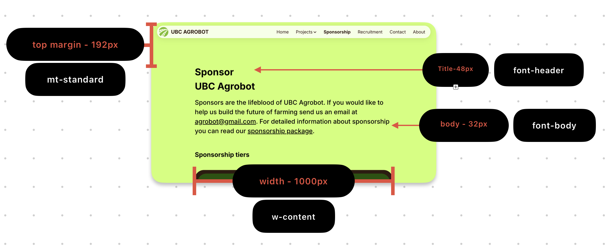
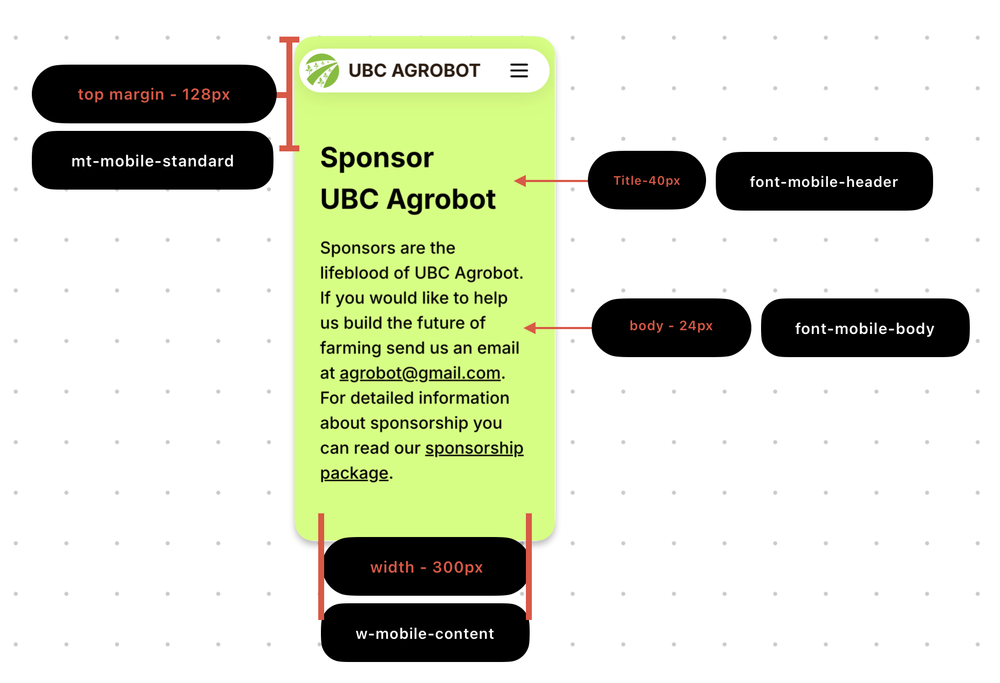

# AgroBot Website

Website will be deployed here:
https://ubcagrobot.github.io/AgroBotWebsite/

### Merge to Next.js notes:
Directory based structure. All components are within the folder the page lives on. Except common components which are placed in the components folder.

NO FUNNY EXPORTING WITH IMAGES ANYMORE. Images are placed in the public folder and accessed directly. Ie this:

~~~
import {HomeFarm} from '../../assets/'
function component() {
    return 
}
~~~

Becomes
~~~
function component() {
    return 
}
~~~

### Layout guide:
These rules should be defied or else the site will look like a word doc. Use these as a general guide.

Values in red, tailwind styles in white

